# Veiledning 4

## Animert kart med AIS data

Vi skal lage et animert kar med tidsskala som viser bevegelser av skip i Oslo-fjorden basert på AIS-data fra området.

Du kan hente [filene til denne veiledning på github](https://github.com/GeoForum/veiledning04) - eller du kan bygge strukturen opp selv.

Se dette eksemplet som <a href="http://geoforum.github.io/veiledning04/" target="_blank">live demo på github pages</a>. Følge evt [denne instruks](testserver.md) hvis du vil sette opp lokal test-server.

## CartoDB

### Last opp data

Lag først en konto til CartoDB, hvis du ikke har en fra før - det gjøres her:
https://cartodb.com/signup

Etter du er logget inn ser det slik ut:

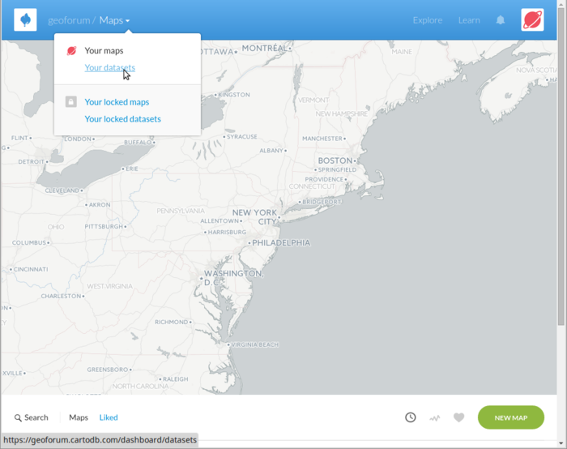

Gå til "Your datasets" og last opp data - fra denne filen (CartoDB tar også imot slike filer i zip-format):
[data/ais_20130829.geojson.zip](data/ais_20130829.geojson.zip)

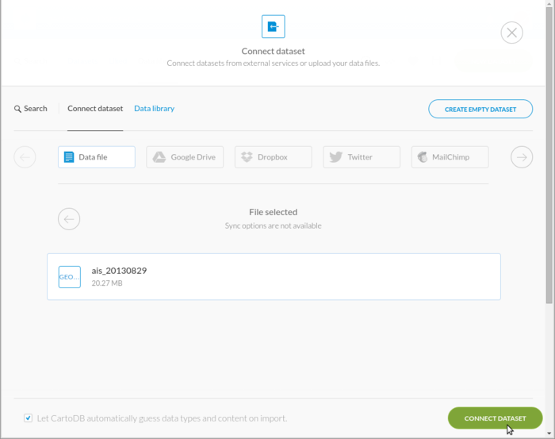

Når opplastingen er klar, ser du datastrukturen som en tabell:

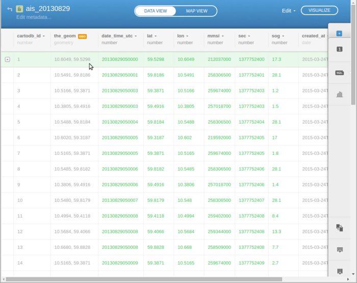

Kolonnene "lat" (for latitude / breddegrad) og "lon" (for longitude / lengdegrad) er posisjonen fra den opprinnelige geojson fil. Hvis det er muligt lager CartoDB alltid en kolonne kallet "the_geom" med geometrien i binært format. CartoDB bruker [PostgreSQL](http://www.postgresql.org/) / [PostGIS](http://postgis.net/) spatiale databaser på serverne - slike databaser har sitt eget binære format for geometri.

Utover geometrien er det kolonnen data_time_utc, vi er interessert i - den inneholder tidsstempel for observasjonen.

### Vis på kart

Klikk på "Map view" over tabellen:


Det vises nå et kart med samtlige punkter vist på en gang - dette er ganske uoversiktlig, og man ser at CartoDB sliter med å vise så mye data samtidig:

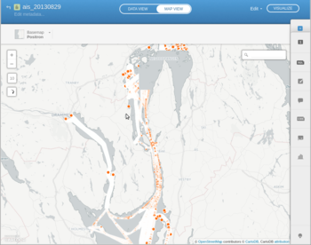

Datasettet inneholder nesten 74 tusene punkter - dette kan bla sees ved å bruke SQL-vertøyet til høyre:

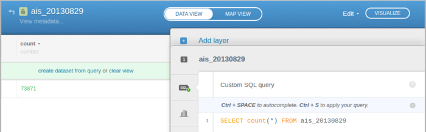

### Animasjon

Klikk på "Wizard" og "Torque" for å få til et animert. Du vil nå se et kart med punkter som beveger seg:

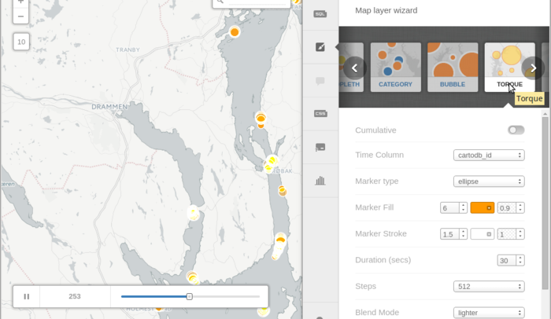

Feltet "Time Column" viser, at det i øyeblikket animeres etter verdiene i kolonnen cartodb_id - det gir ikke mening, siden den inneholder en tilfeldig unik id for hver rekke. Kolonnen "date_time_utc" inneholder tidsstempel men i feil format - det kan konverteres til postgresql tidsformat med dette uttryk:

```sql
SELECT *, 
to_timestamp(date_time_utc::text,'YYYYMMDDHH24MISS') datokolonne 
FROM ais_20130829
```
Sett deretter "datokolonne" som tidskolonne. Hvis man ønsker å optimere performance, er det bedre bruke en annen metode enn SELECT - fx lage en ny kolonne og bruke update - eller lage et view som indekseres.

### Kartografi

En rekke andre parametre er satt fra start og kan endres - prøv fx å endre:
* Marker fill 
  * størrelse - fx 3 istedet for 6
  * farge - fx #FF5C00
  * opacity - fx 0.7 i stedet for 0.9
* Marker stroke - fx 0 i stedet for 1.5.
* Duration - 15 sekund i stedet for 30.
* Steps - 128 i stedet for 528
* Trails - fx 6 i stedet for 3

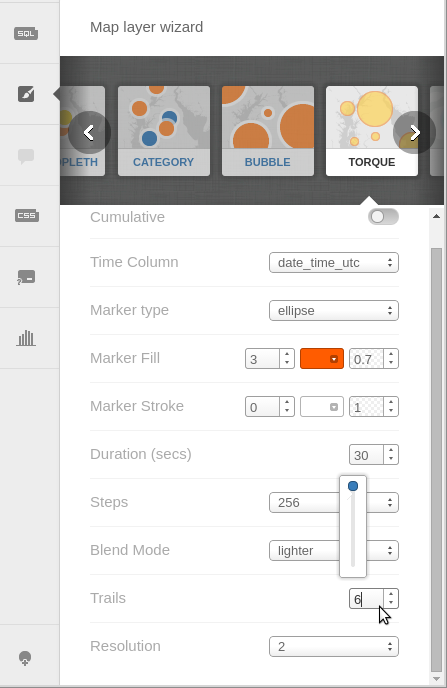

Prøv også å endre bakgrunnskartet til fx "World Midnight Commander":

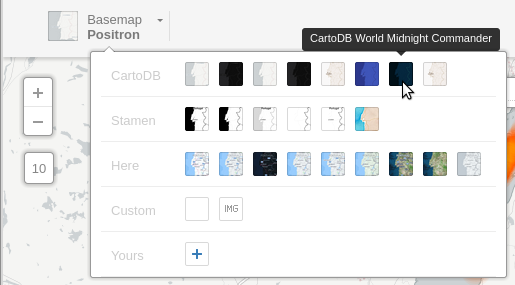

### Del kartet

Når du er fornøyd med resultatet, er du klar til å dele kartet. Klikk på "Visualize" øverst til høyre:

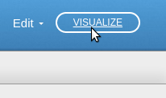

Gi kartet et navn, klikk "Create map":

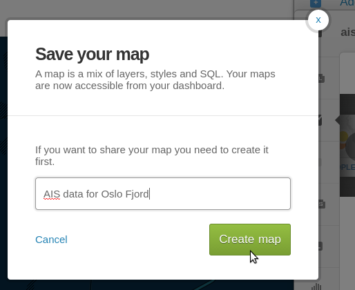

Og etterpå "Share" øverst til høyre:

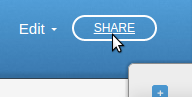

Du er nå klar til at å dele kartet - enten med url, iframe eller som json data som kan brukes i en annen applikasjon:

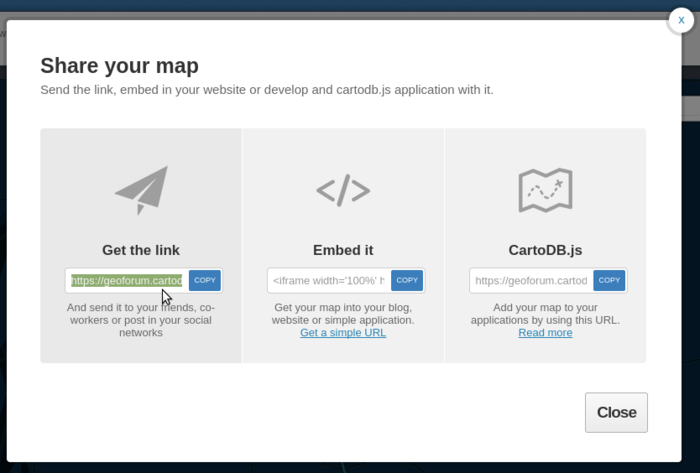

Følg link:
https://geoforum.cartodb.com/viz/1e011756-047e-11e5-a884-0e018d66dc29/public_map

Eller se <a href="http://geoforum.github.io/veiledning04/" target="_blank">live demo på github pages</a>.